# OpCon RPA

OpCon Robotic Process Automation (RPA) continues automation through the **last mile** whether on a desktop, the web, or a hybrid of both. Where OpCon workflows, processes, or tasks pause for human intervention, OpCon RPA addresses manual gaps, enables end-to-end automation, and increases the efficiency of individual employees and the entire business. 

OpCon RPA is an OpCon extension with exponential implications. 


## Getting Started

**Robotic Process Automation** refers the ability to record a sequence of human interactions (keystrokes and mouse movements and clicks) with a program and play them back on demand.  

**OpCon RPA** is designed for banks, credit unions, and insurance companies for use in tandem with OpCon extending its functionality and usefulness.

---

## Installation, License Configuration & Registration

### System Requirements

#### Operating systems

- VisualCron is designed for Windows based computers
- VisualCron works on the following operating systems: Windows Server 2008 R2/2012/2016/2019/2022 and Windows 8/10/11
- VisualCron works on both 32-bit and 64-bit processors
- VisualCron requires .NET 4.8

#### Computer requirements (Server only)

- Operating system - recommended Windows operating system is Windows Server 2008 R2/2012/2016/2019/2019/2022
- Disk space - please reserve 1GB to 4GB depending on how much logging you need to store
- CPU - 2GHz or more, quad core or more
- Memory - 4GB or more

#### Computer requirements (Client only)

- Operating system - recommended Windows operating system is Windows 8/10/11
- Disk space - please reserve 1GB
- CPU - 2GHz or more, quad core or more
- Memory - 4GB or more
- Minimum screen resolution 1920*1080

#### Computer requirements (Client and Server)

- Operating system - recommended Windows operating system is Windows Server 2008 R2/2012/2016/2019/2022
- Disk space - please reserve 1GB to 4GB depending on how much logging you need to store
- CPU - 2GHz or more, quad core or more
- Memory - 4GB or more
- Minimum screen resolution 1920*1080   

### Acquiring a License

To get started with OpCon RPA, please contact your OpCon customer service representative.  Your representative will assist you through the process of completing the requirements to get start with RPA.

More information in regards to pricing and packaging for OpCon RPA **[is available here.](https://smatechnologies.com/opcon-pricing)**

### Install OpCon RPA for Cloud
The RPA Agent and Netcom Relay will need to be installed on the windows system that will be responsible for hosting the server and/or client and executing the RPA workflow.

You should have 3 items ready for before you get started with the RPA cloud setup. 

1.	The NetCom Relay installer, <ins>SMANetcomRelay.exe</ins>.  The NetCom Relay installer is not needed if you are not integrating RPA with a cloud instance of OpCon CORE Automate/Solution Manager.
  1.	On your Windows Computer open the command prompt and choose “Run as Administrator”.
  2.	When prompted if you’d like to allow this app to make changes to your device, choose “Yes”.
2.	The ACS Plugin DLL named <ins>sma.acs.OpConRPA.dll</ins>.
3.	The RPA Agent installer named <ins>RPAAgent.1.0.0</ins>.

#### SolutionManager Setup
1.	Log into Solution Manager
2.	Navigate to the Access Management screen
  1.	On the USER tab select the user who will be configuring the RPA connection.
  2.	In the context of the selected user click the SETTINGS tab.
  3.	Ensure the selected user has “Enable external tokens” checked.
  4.	If this option was not checked and the user is currently signed in, this user will need to sign back in before this change will take affect.
3.	Navigate to your user profile page.
 1.	On this page within the ACCOUNT tab ensure that you have a password set.
 2.	Make sure you remember this password, you’ll need it later.
 3.	Click to save.
 4.	Navigate to the EXTERNAL TOKEN tab.
 5.	Leave the API Token option selected and click “Generate”.
 6.	Copy this token to your clipboard AND save it in a safe place, you will need it later. It will be used for the Relay set up
 7.	Click OK to dismiss the window.
4.	(Skip for On-Prem) Return to the Windows Command Prompt and change directories (cd) to the directory where you have save the SMANetComRelay.exe file.  
5.	(Skip for On-Prem) Once in the correct directory type SMANetComRelay.exe and press ENTER.
6.	(Skip for On-Prem) You will be asked to select your next step, choose Register & Install NetCom Relay Service by pressing enter when that line is highlighted/selected.
7.	(Skip for On-Prem) You will be asked to give a name to identify your environment. 
 
 1. You can leave it as the default or you can rename it to something different. 
 2. Press enter when complete.
8.	(Skip for On-Prem) You will be asked to enter a Relay name.
 
 1. You can leave it as the default or you can rename it to something different. 
 2. Press enter when complete.
9.	(Skip for On-Prem) You will be asked to enter your OpCon URI.
 
 1. You must ender the fully qualified domain name here including the https://
 2. Press enter when complete.
10.	(Skip for On-Prem) You will be asked for the External Event Token.  This is the token you created in step 3.5 in this section above.
 
 1. Type or paste the token in.
 2. Press enter when complete.
11.	(Skip for On-Prem) Take a screen capture, you will want the name of this Relay later. In this example the name is: HEATHERMCBRA617. But you should use the name you chose in step 7 of this section.
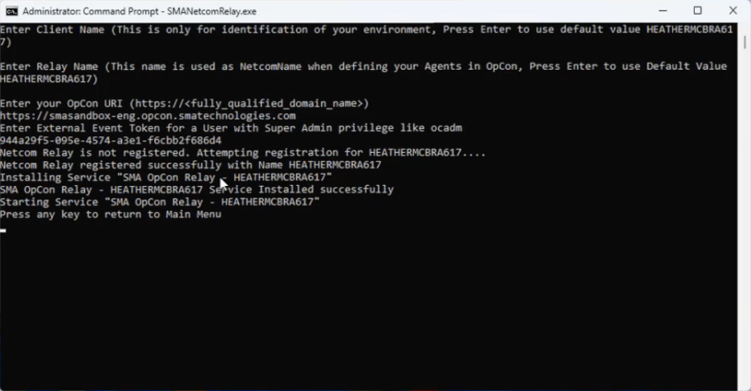 
12.	(Skip for On-Prem) Relay should now officially be installed.

#### RPA Agent and Relay Connection setup
1.	In your Windows File Explorer Navigate to C:\Programdata.   
2.	Drill down into the OpConxps directory until you reach the Plugins directory.
 - PRO TIP: the SMANetComRelay.exe file that exists in this directory should be kept.  Ensure it is in a place where it will not be deleted. The best place for this file is: C:\Program Files\OpConxps\Relay.
 
3.	Open the Plugins directory, this is where you’re going to put the RPA Plugin DLL file. For On-Prem users this should be C:\ProgramData\OpConxps\SAM\plugins.
 1.	Navigate to where you have the The ACS Plugin DLL.  It is called sma.acs.OpConRPA.dll. 
 2.	Move this .dll file into the plugins directory shown in step 2 of this section.
4.	(Skip for On-Prem) Restart the Relay service with the following steps:
 1.	In the Windows start menu type Services.exe and open it.
5.	(Skip for On-Prem) Right click on SMA – OpCon Relay – [your chosen name] 
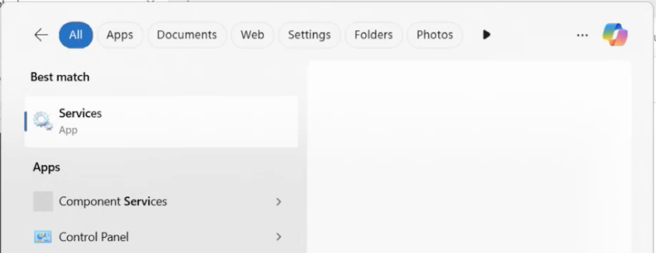 
6.	(Skip for On-Prem) From the context menu select restart.
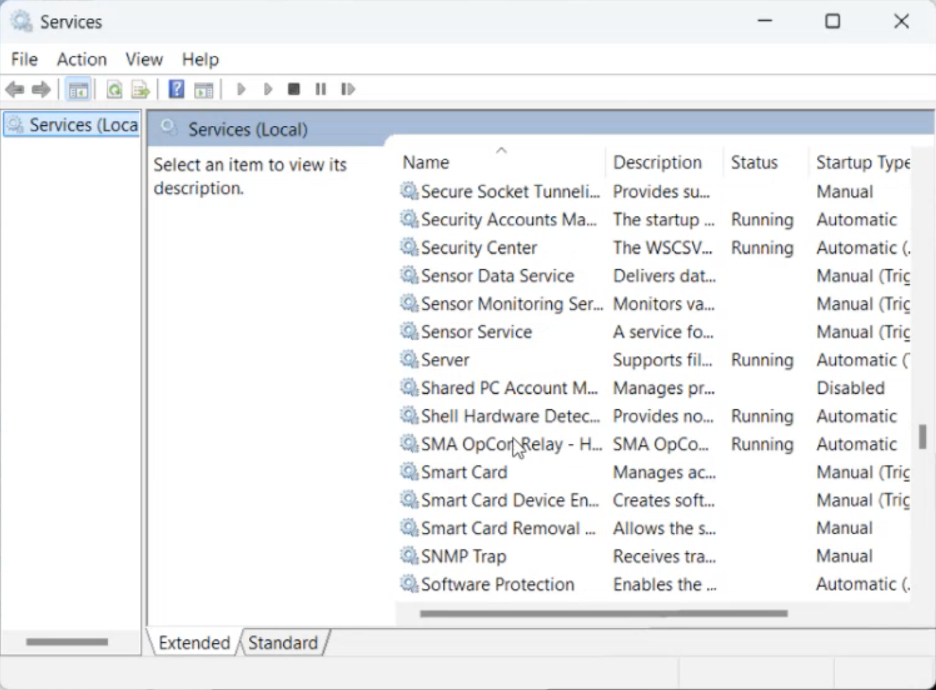 

#### Testing what you’ve set up so far:
1.	Opening Solution Manager.
2.	Navigate to the Library > Agents.
3.	Click Add to add a new Agent.
 1.	Give your agent a name, remember this name, you’ll need it later.
 2.	Open up the General Settings section.
  1.	Set NetCom Name to the NetCom Relay name you chose in step 11 of Solution Manager Setup section. For On-Prem you should use <Default>.
   
 3.	Select RPA from the type drop down above General Settings.
 4.	Open the RPA Settings section at the bottom of the page.
  1.	Leave this open, you’ll come back to it shortly.

#### FINALLY the RPA Installer
1.	Double click on the RPA Agent Installer.  It is named RPAAgent1.0.0 (though the version number might differ)
2.	When prompted if you’d like to allow this app to make changes to your device, choose “Yes”.
3.	When the installation is complete you will see the RPA user interface pop up on your screen.
4.	On the left side of the RPA interface click “Settings”.
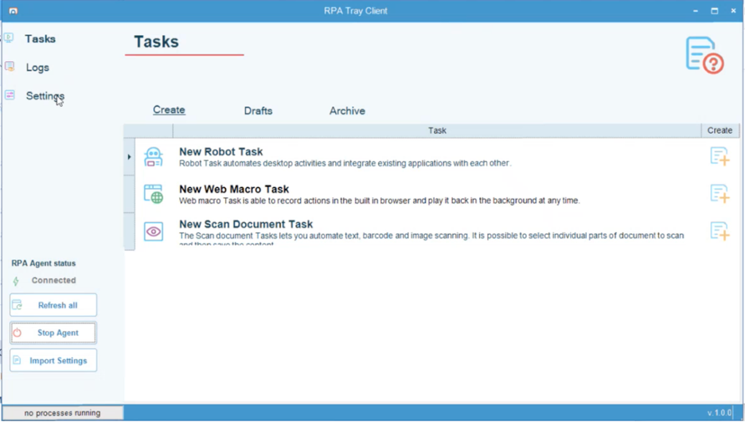 
5.	When on the “Settings” screen make sure you’re on the RPA Agent tab and copy the value out of the Https URI field.
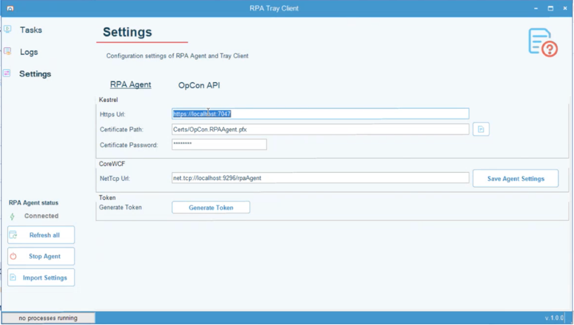 
6.	Paste that URI value into the RPA Server URI in Solution Manager.
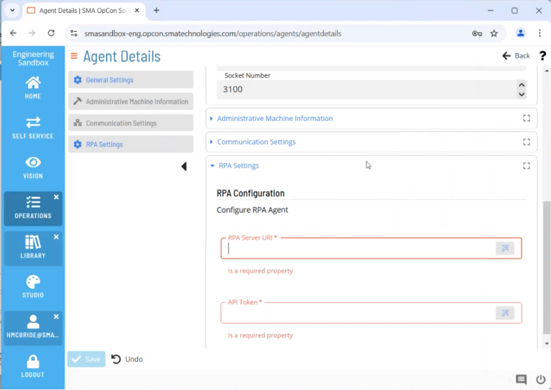 
7.	Back in the RPA interface, click generate token.  Note, that this automatically copies the token to your clipboard.
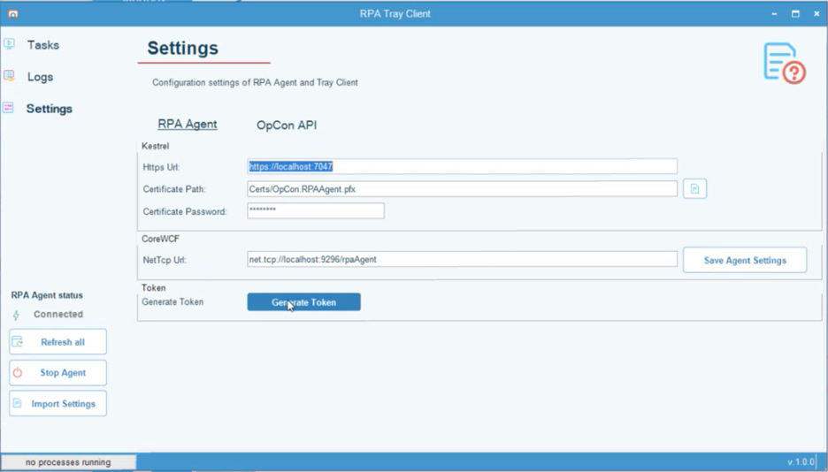 
8.	Paste that token in the API Token field within Solution Manager.
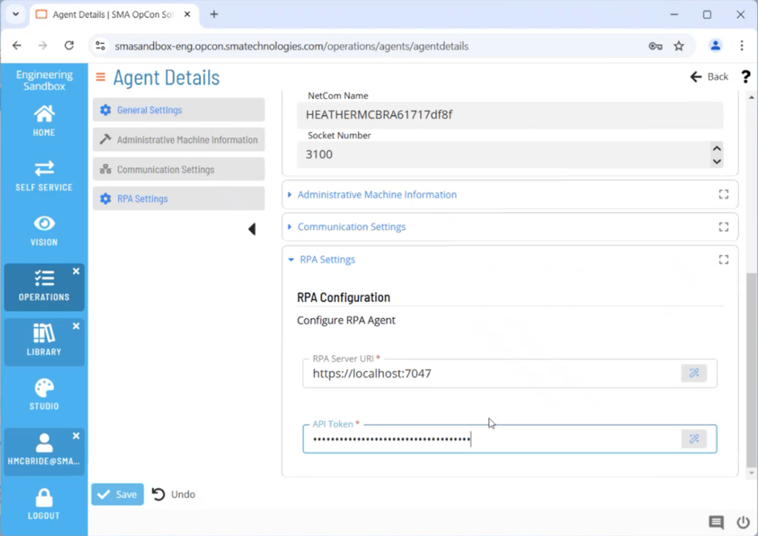 
9.	Click to save your Solution Manager changes
10.	In the RPA “Settings” interface click on the OpCon API tab.
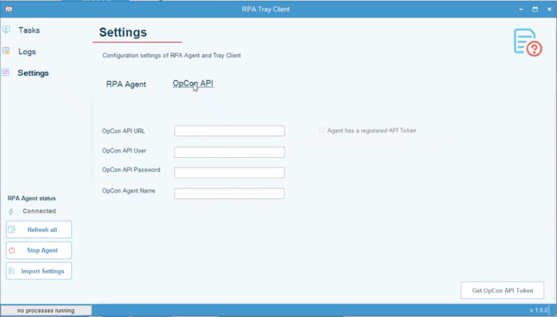 
11.	In the OpCon API URL field enter the same fully qualified domain name that you set in the Solution Manager Setup step 9. For On-Prem this is likely the base domain of your Solution Manager instance.
12.	In the OpCon API User field enter the username you’re logged in with your instance of Solution Manager.
13.	In the OpCon API Password field enter the password you set in step 3.2 of the Solution Manager Setup section.
14.	In the OpCon Agent Name field enter the name of the Agent you just created in step 3.1 of the Testing What You’ve Setup So Far.
15.	Click Get OpCon API Token in the lower right corner of the RPA interface.
16.	You should receive a success message at this point!!! Congratulations you’re ready to go!!!

### Install VisualCron for RPA

The VisualCron Server and Client will need to installed on the windows system that will be responsible for hosting the server and/or client and executing RPA workflow.  
 - Instructions to install VisualCron RPA **[are available here.](https://help.smatechnologies.com/opcon/agents/opcon-rpa/visualcron-rpa)**  

### Activate the License Key and Register the Environment

:::caution
A unique license will be required for each installation of VisualCron server application, but several clients are able connect to one server with one license.
:::

#### Activation

  

- Once you have an activation code you can activate VisualCron. To activate VisualCron you must login to the server that you want to activate. If you have trial time left you can go to main menu Client->Server tab->License->Activate, which opens the activation form. If you don't have any trial time left, the activation form will open automatically when logging in. Enter the activation code in the fields.

:::caution Online Activation  

To be able to validate your activation code you have to connect to the VisualCron web site, this is done automatically when you click on the Activate button.  

For online activation, ensure you are:  
1. Connected to the Internet.  
2. Let VisualCron access the internet. If your firewall asks you what to do, you must permit VisualCron to access Internet.  

:::

---

## General Concepts
### Overview of RPA w/ OpCon
#### RPA Configuration in VisualCron  
This is a representation of the structure of all VisualCron objects to consider when planning a workflow.    

 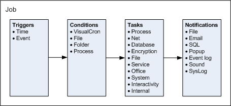  

:::note
The flow is: Trigger > Condition > Task > Notification.
1. One trigger (type time or event) fires a Job to run.
2. A condition is a "check" which is evaluated before a Job or a Task is launched.
3. A Job can include one or more Tasks of different types.
4. When the Job and/or its Tasks are completed, one or more notifications (of different types) may be performed.
:::

:::note
#### RPA Workflow Object Reference
| RPA Object | OpCon Equivalent       | Description                                                                                                       |
|------------|------------------------|-------------------------------------------------------------------------------------------------------------------|
|Job         |Schedule                |A job in VisualCron is similiar to a schedule in OpCon in their ability to group and execute one or more processes.|
|Task        |Job                     |A task in VisualCron is similiar to a job in OpCon representing the execution of a specific process                |
|Trigger     |Event or Cloud Trigger  |A trigger in VisualCron performs actions similiar to OpCon frequencies and events.                                 | 
|Condition   |Dependency              |A condition in VisualCron is similiar to a job dependency in OpCon.                                                |
|Credential  |System/Batch Users      |A credential performs a similiar function to a batch user or windows/system user in OpCon.                         |
|Connection  |Agent Users             |A connection in VisualCron is similiar to configuring service specific user credentials for an Agent in OpCon.     | 
:::

#### Workflow Orchestration w/ OpCon  

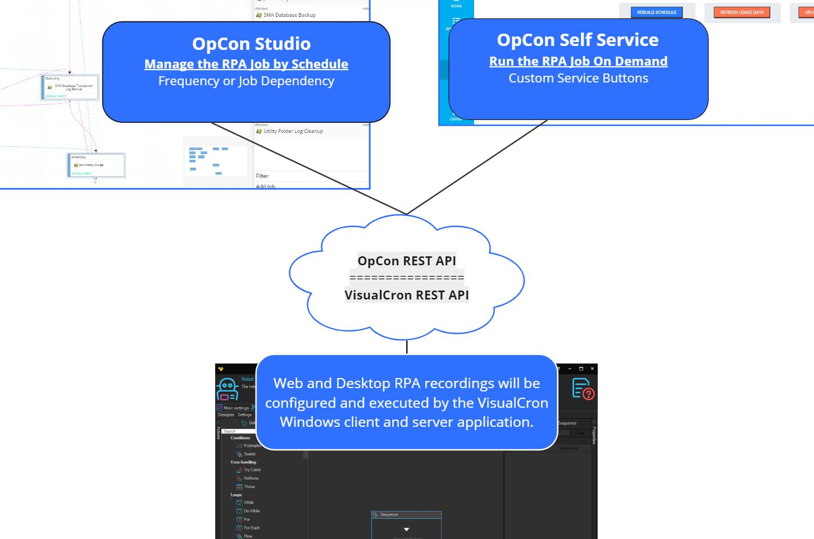  

---

## General Navigation & Management
### Accessing the Application
The VisualCron Client is a separate application that constitutes the main type of user interface for VisualCron. With the client you configure VisualCron and manage the Jobs and Tasks that are run by the server.

The client application is started from the Windows desktop icon (VisualCron X) or the Start menu Program > VisualCron X > VisualCron Client. 

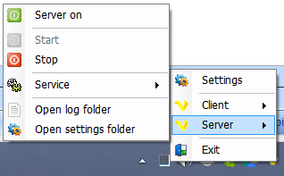  

You can also double click on or open the VisualCron Tray Client to start the VisualCron Client.
- As the VisualCron server handles the defined Jobs, the VisualCron client can only connect to the VisualCron server when the server is running.
- As the VisualCron server runs as a service, the client application can be closed without affecting the core server activities.

### Server Configuration

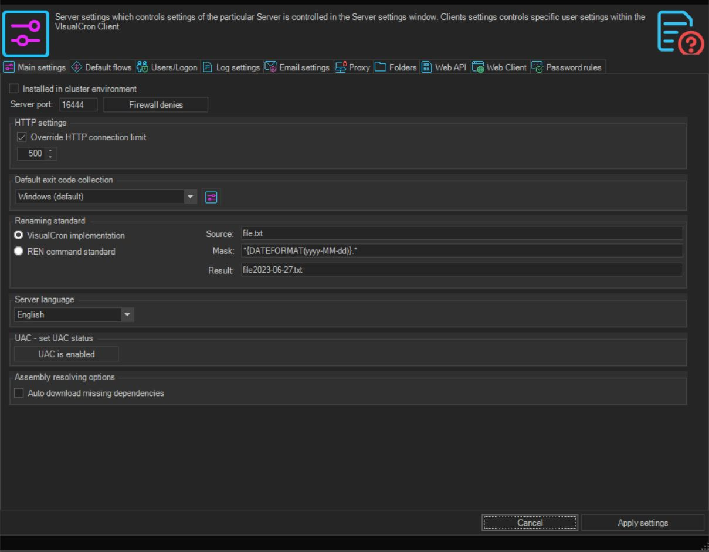  

#### General Server Settings

The VisualCron server runs as a Windows service in the background. The server service status is Started when the server computer is started.

The VisualCron server application status can be **On** or **Off**. If the server is On, it will be looking for Jobs to run. If Off, no Jobs will be run unless a user forces it manually in a client. The server application is running, even if no one is logged on to the computer where the server is running or if no client application is connected to the server.

In the VisualCron client, the currently selected server name is displayed in the main menu Server server name tab and in the Username/Server entry in the the Server/Groups/Jobs/Tasks grid and in status bar. Server connections are global, thus if you change a connection definition, this will affect all commands associated with this connection.

:::caution
The default port number between the VisualCron Server and the Client is **16444**. This means, that if you are connecting remotely from the outside you may have to open port **16444** in your firewall, software and/or hardware.
:::

#### Enable the Web REST API

 

:::tip Server Health

  

Click on the health status indicator to view the server's historical performance.

:::

---

## Workflow Configuration

### RPA Job Configuration with VisualCron


#### Step 1 - Set up Environment Credentials and Connections    
Create and manage system and user requirements for authentication between required services and the server environment. 

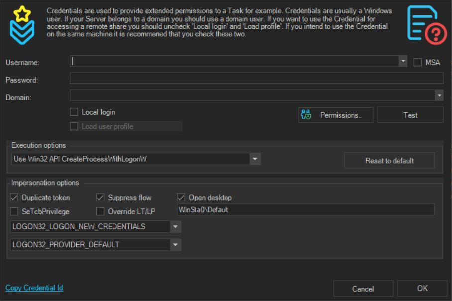  

- From server settings menu, navigate and select the _**Credentials**_ view.  
 
  

- From server settings menu, navigate and select the _**Connections**_ view.  
- These can be reused as required when creating new jobs and tasks.

#### Step 2 - Create a New Job

Create a new job for grouping one or more related RPA tasks for acheiving a desired workflow.


 - Right click on the Job Group View, navigate and select _**Add Job**_ from the menu. 

:::tip Confirm ROI Values when Creating a new Job

   

ROI value is captured at the job level.  Ensure your default ROI settings are updated and configured during job creation to start capturing history.  

The unit value is based on the currency configured in Server > ROI settings.  (**[Where to update default ROI values](#Measure-and-Track-ROI-for-RPA-Tasks)**)   
 - Job rate represents savings in *ex.USD* per hour for all tasks assigned to the job.
 - Job time represents saving in time *ex. minutes* for all tasks assigned to the job.
:::

##### Create an RPA Task for a Web Based Process   

Add and record one or more web rpa tasks.  This task type should be used for recording manual tasks with a web browser and supports background replay of multiple tasks in paralell.

  

 - Right click on the RPA job, navigate and select _**Add Task > Net > Web Macro**_ 

##### Create an RPA Task for Windows Desktop and Hybrid *(Web & Desktop)* Processes

Add and record one or more desktop or hybrid tasks.  This task type should only be used for recording simple desktop tasks and requires full control of the host system.

   

 - Right click on the RPA job, navigate and select _**Add Task > Interactivity > Robot**_  

:::caution

- The RPA desktop recorder will take full control of the host system in order to execute the workflow.
  - A dedicated machine is preferred for executing the playback of desktop rpa tasks in order to ensure sufficient resources are available and that the recording and playback of tasks do not interfere with the management of other critical operations. 

- RPA desktop tasks can only support recording workflow on the host system which VisualCron is installed.
  - The RPA desktop recorder does not currently support the ability to replay workflow recorded on a remote virtual machine.

:::

#### Step 3 (Optional) - Use Conditions or Triggers for Jobs and Tasks 

##### Configure a Job or Task Condition

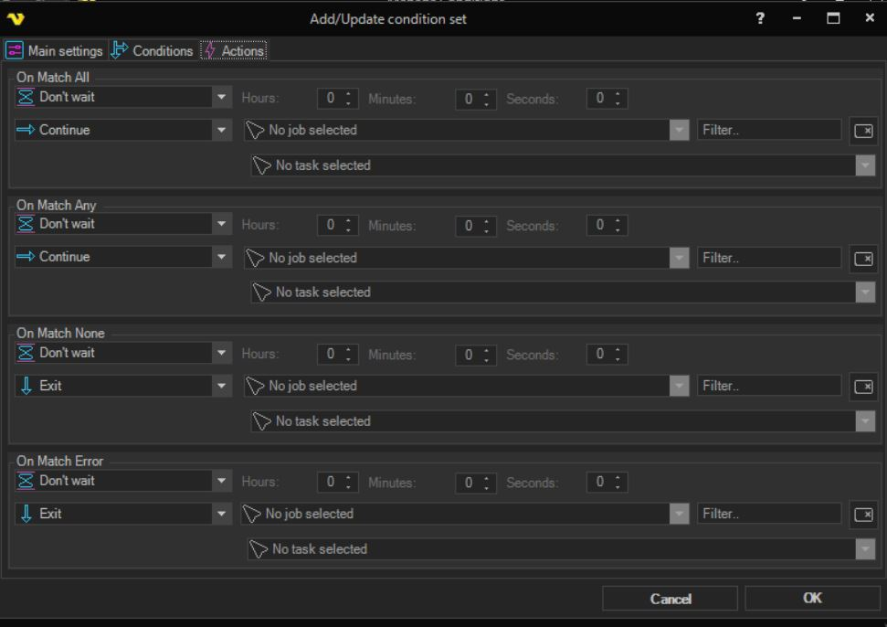  

 - Right click to edit an RPA **job or task**, navigate to the _**Condition Tab**_ to configure a conditional status requirement for starting the RPA **job or task**.

##### Configure a Job Trigger

  
 
 - Select the Triggers tab from the **Edit Job* view to add a time or event trigger.
 - *Shortcut:* Right click on an RPA *job*, navigate to the _**Triggers**_ from the menu to configure a custom requirement for starting the RPA **job**.  


:::tip Ideas for getting started with with OpCon RPA 

**Ideas for RPA Job Execution**  
 - Start an rpa job on specific days of the week and/or time of the day.

 - Start an rpa job once a previous job condition or status has been fulfilled.

 - Start an rpa job by creating a self-service button for authorized users access on-demand.

 - Start an rpa job based on file activity with an MFT Server cloud trigger or a file arrival job dependency.  
  -- [Learn more about what is possible with OpCon MFT Server Triggers here.](https://help.smatechnologies.com/opcon/agents/opconmft/server-triggers)

 - Start an rpa job using an opcon event triggered by another process.  

 - Start an rpa job by updating a variable trigger in visualcron.  

---

**Ideas for Optimizing OpCon Schedules**    

 - Upload and download web based files or execute manual file movements.  

 - Copy, parse and store data from a file or web page into a variable.  

 - Copy, parse and store data from a file or a web page table into a file. *(ex. excel)*  

 - Perform a task for a windows based application.  

 - Perform Windows system or local server related tasks.  
  -- *ex. Perform core business windows client tasks.*  

 - Perform a task for a web browswer based application.  
  -- *ex. Update customer and employee information.*  

:::

### Orchestration with OpCon

#### Managing Job Execution with OpCon

  

**Schedule by Frequency *(Time)* or Dependency _(Event)_**  
 - Orchestrate RPA workflow with OpCon by expanding schedules to include and start execute RPA jobs remotely.  

 - Choose a method for starting the RPA job:  
  -- Based on calendar and frequency  *(date and time)*  
  -- Completion of a previous job or event in the schedule *(job dependency)*  
  -- Output of a previous job *(variable trigger)*  

:::tip

Supplement daily workflows with RPA jobs to reduce their overall manual burden or to extend the workflow for existing schedules. 

:::

 

**Use Self-Service Buttons _(On-Demand)_**
RPA jobs can also be initiated on-demand by configuring a self-service button for users to either trigger the RPA job directly or indirectly by fulfilling a required job dependency. 

#### OpCon Job Configuration - Create Jobs for initiating RPA Workflow

**Option 1 - Enterprise Manager: Use the OpCon Web Services Connector with a Job Template**
  1. Install the web services connector ([Download and install with the Opcon Web Installer](https://smatechnologies.hosted-by-files.com/OpConPublicUtilities/OpConWebInstaller.zip))
  2. Create a new schedule or open an existing schedule in workflow designer.
  3. Add a new master job   
     1. **Job Type:** *Windows*  
     2. **Job Sub-Type:** *Web Services*  
  4. Import the RPA job template and update the host variable and the job name variable to the name of the RPA job configured in VisualCron.  
  - [Copy the OpCon RPA Web Services script from below and save it as .web template.](#OpCon-RPA-Web-Services-Script) `ex. OpConRPAtemplate.web`  

**Option 2 - Solution Manager: Use the Web Services Connector with Embedded Scripts**  
 - In Solution Manager, navigate to `https://localhost/library/scripts` to create a new script runner and script type.  

  :::note  New Script Type

  
  `https://localhost/library/scripts/types`
    - **Name:** *Webservices*   
    - **File Extension:** *.web*   

  :::

  :::note  New Script Runner

  
  `https://localhost/library/scripts/runners`
    - **Name:** *WebServicesRunner*
    - **OS:** *Windows*  
    - **Script Type:** *Webservices*  
    - **Command Template Parameters:** *C:\[Path to Webservices Connector]\SMAWSConnector.exe $FILE $ARGUMENTS*  

  :::

  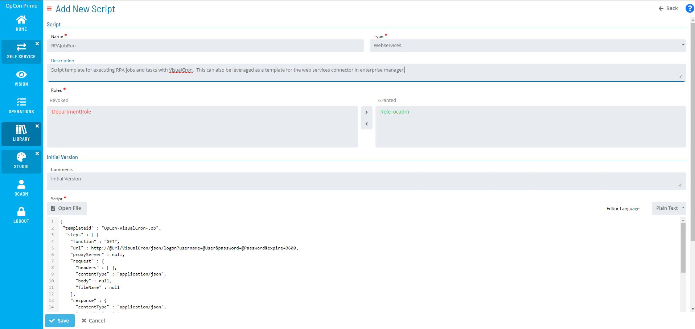  

  2. Modify and upload the script to the OpCon script repository.  `https://localhost/library/scripts`    
	 - The script itself is parameterized for user codes, password, url, jobname, variables with the arguments set as variables.  
  3. In Solution Manager, navigate to `https://localhost/studio` to create a new schedule or open an existing schedule in studio.
  4. Add a new windows master job with the job action of **'Embedded Script'** and assign the script runner and embedded script to the master job and set the values for the environment variables.

   

---
### OpCon RPA Web Services Script

:::note OpCon RPA Web Services Script Overview

*This example script below performs 4 functions and can be leveraged as a template for setting up RPA with OpCon:*  
1. Retrieve an authentication token and update the associated variable for subsequent steps.  
2. Retrieve the id of the job (required to start the task).  
3. Start the task by passing variable values.  
4. Monitor the task to completion.  

:::

```json
{
 "templateid" : "OpCon-VisualCron-Job",
  "steps" : [ {
    "function" : "GET",
    "url" : http://@Url/VisualCron/json/logon?username=@User&password=@Password&expire=3600,
    "proxyServer" : null,
    "request" : {
      "headers" : [ ],
      "contentType" : "application/json",
      "body" : null,
      "fileName" : null
    },
    "response" : {
      "contentType" : "application/json",
      "variables" : [ {
        "name" : "@Token",
        "value" : "$.Token"
      } ],
      "ignoreResult" : false,
      "stepCompletionCode" : 200,
      "responseDataCheck" : null,
      "fileName" : null
    }
  }, {
    "function" : "GET",
    "url" : http://@Url/VisualCron/json/Job/GetByName?token=@Token&name=@JOBNAME,
    "proxyServer" : null,
    "request" : {
      "headers" : [ ],
      "contentType" : "application/json",
      "body" : null,
      "fileName" : null
    },
    "response" : {
      "contentType" : "application/json",
      "variables" : [ {
        "name" : "@Jobid",
        "value" : "$.Id"
      } ],
      "ignoreResult" : false,
      "stepCompletionCode" : 200,
      "responseDataCheck" : null,
      "fileName" : null
    }
  }, {
    "function" : "GET",
    "url" : http://@Url/VisualCron/json/Job/Run?token=@Token&id=@Jobid&variables=Test001Time=@TIME|Test001RCode=@RCODE,
    "proxyServer" : null,
    "request" : {
      "headers" : [ ],
      "contentType" : "application/json",
      "body" : null,
      "fileName" : null
    },
    "response" : {
      "contentType" : "application/json",
      "variables" : [ ],
      "ignoreResult" : false,
      "stepCompletionCode" : 200,
      "responseDataCheck" : null,
      "fileName" : null
    }
  }, {
    "function" : "GET",
    "url" : http://@Url/VisualCron/json/Job/Get?token=@Token&id=@Jobid,
    "proxyServer" : null,
    "request" : {
      "headers" : [ ],
      "contentType" : "application/json",
      "body" : null,
      "fileName" : null
    },
    "response" : {
      "contentType" : "application/json",
      "variables" : [ ],
      "ignoreResult" : false,
      "stepCompletionCode" : 200,
      "responseDataCheck" : {
        "goodFin" : "Success",
        "badFin" : "Failed",
        "attributeToCheck" : "$.Tasks.[0].Stats.Result",
        "poll" : true,
        "pollDelay" : 3,
        "pollInterval" : 2,
        "pollMaxTime" : null
      },
      "fileName" : null
    }
  } ],
  "variables" : [],
  "environmentVariables" : [ ],
  "properties" : [ ]
}
```
---

## Reporting & Metrics

### RPA Job History

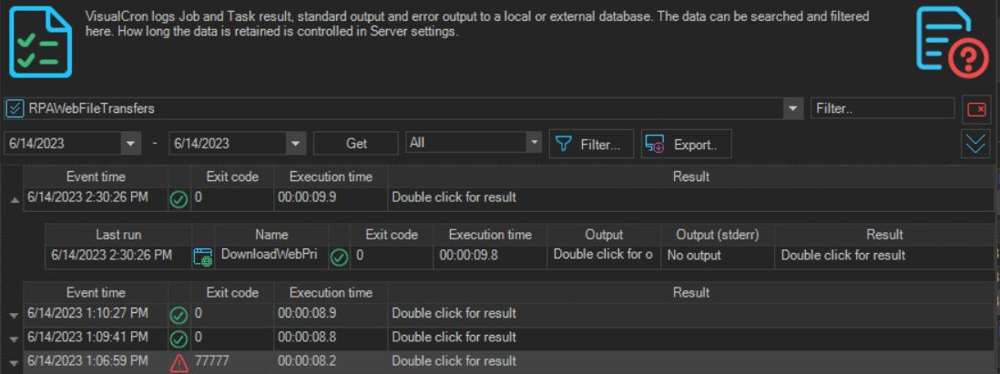

:::tip

- To access job or task log history: Right click on a job or task and select _**log history**_ from the menu.
:::
### Measure and Track ROI for RPA Tasks

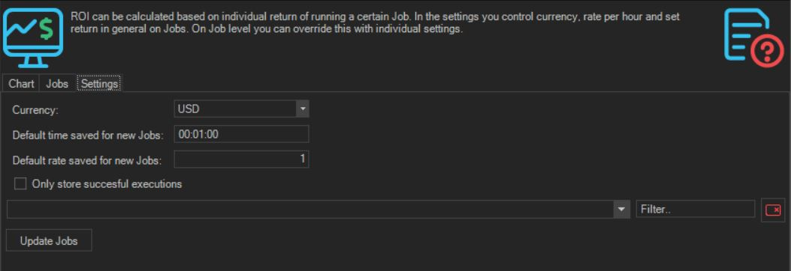

#### ROI Performance

##### Review ROI Savings by Time or Cost

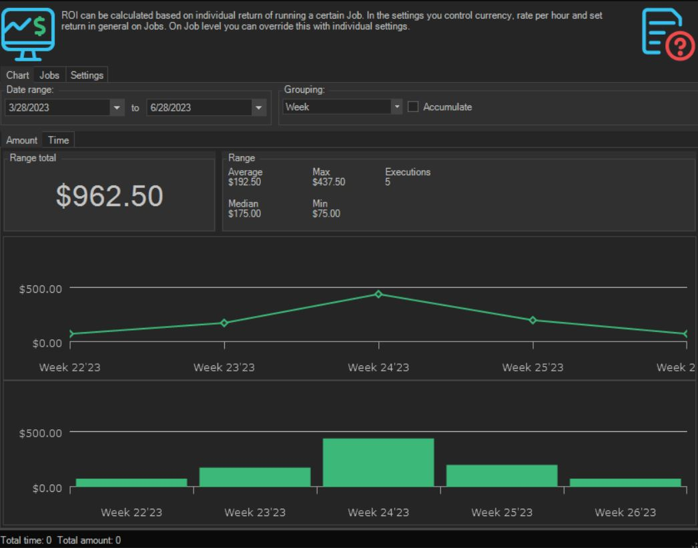

##### Review ROI Savings by Job


## Troubleshooting & Support

### RPA Job and Task Status & Results

:::tip Operational Status

  

For quick access to a summary of active jobs or recent job failures, navigate to the failed jobs or running jobs view on the server settings tab. 

:::

#### Audit History

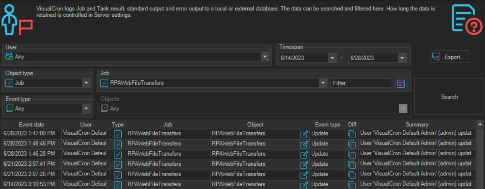

### RPA Job Logs  

To access job or task log history: Right click on a job or task and select _**log history**_ from the menu.
- Settings for debug log entries are found in the main menu Manage -> Manage server settings -> Log settings tab.
- Additional debug and log information is available for the server and log function.

### Known Limitations

- The RPA desktop recorder will take full control of the host system in order to execute the workflow.
  - A dedicated machine is preferred for executing the playback of desktop rpa tasks in order to ensure sufficient resources are available and that the recording and playback of tasks do not interfere with the management of other critical operations. 

- RPA desktop tasks can only support recording workflow on the host system which VisualCron is installed.
  - The RPA desktop recorder does not currently support the ability to replay workflow recorded on a remote virtual machine.

### Support Information

**[SMA Support Links and User Community](https://smatechnologies.my.site.com/SMAOpConUserCommunity/s/login/)**  
**[Full VisualCron User Documentation](https://www.visualcron.com/documentation.aspx)**  

---