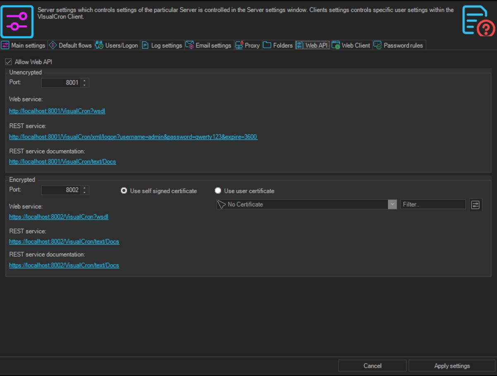

# General Navigation & Management

### Accessing the Application

The VisualCron Client is a separate application that constitutes the main type of user interface for VisualCron. With the client you configure VisualCron and manage the Jobs and Tasks that are run by the server.

The client application is started from the Windows desktop icon (VisualCron X) or the Start menu Program > VisualCron X > VisualCron Client. 

  

You can also double click on or open the VisualCron Tray Client to start the VisualCron Client.
- As the VisualCron server handles the defined Jobs, the VisualCron client can only connect to the VisualCron server when the server is running.
- As the VisualCron server runs as a service, the client application can be closed without affecting the core server activities.

### Server Configuration

  

#### General Server Settings

The VisualCron server runs as a Windows service in the background. The server service status is Started when the server computer is started.

The VisualCron server application status can be **On** or **Off**. If the server is On, it will be looking for Jobs to run. If Off, no Jobs will be run unless a user forces it manually in a client. The server application is running, even if no one is logged on to the computer where the server is running or if no client application is connected to the server.

In the VisualCron client, the currently selected server name is displayed in the main menu Server server name tab and in the Username/Server entry in the the Server/Groups/Jobs/Tasks grid and in status bar. Server connections are global, thus if you change a connection definition, this will affect all commands associated with this connection.

:::caution
The default port number between the VisualCron Server and the Client is **16444**. This means, that if you are connecting remotely from the outside you may have to open port **16444** in your firewall, software and/or hardware.
:::

#### Enable the Web REST API

 

:::tip Server Health

  

Click on the health status indicator to view the server's historical performance.

:::