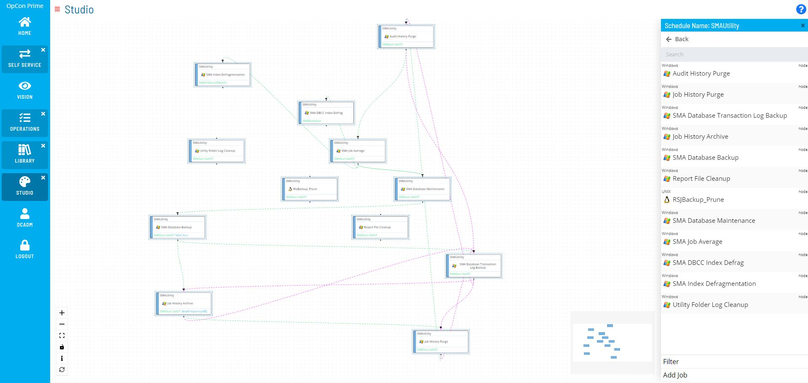
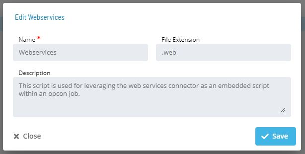

### Orchestration with OpCon

#### Managing Job Execution with OpCon

  

**Schedule by Frequency *(Time)* or Dependency _(Event)_**  
 - Orchestrate RPA workflow with OpCon by expanding schedules to include and start execute RPA jobs remotely.  

 - Choose a method for starting the RPA job:  
  -- Based on calendar and frequency  *(date and time)*  
  -- Completion of a previous job or event in the schedule *(job dependency)*  
  -- Output of a previous job *(variable trigger)*  

:::tip

Supplement daily workflows with RPA jobs to reduce their overall manual burden or to extend the workflow for existing schedules. 

:::

 

**Use Self-Service Buttons _(On-Demand)_**
RPA jobs can also be initiated on-demand by configuring a self-service button for users to either trigger the RPA job directly or indirectly by fulfilling a required job dependency. 

#### OpCon Job Configuration - Create Jobs for initiating RPA Workflow

**Option 1 - Enterprise Manager: Use the OpCon Web Services Connector with a Job Template**
  1. Install the web services connector ([Download and install with the Opcon Web Installer](https://smatechnologies.hosted-by-files.com/OpConPublicUtilities/OpConWebInstaller.zip))
  2. Create a new schedule or open an existing schedule in workflow designer.
  3. Add a new master job   
     1. **Job Type:** *Windows*  
     2. **Job Sub-Type:** *Web Services*  
  4. Import the RPA job template and update the host variable and the job name variable to the name of the RPA job configured in VisualCron.  
  - [Copy the OpCon RPA Web Services script from below and save it as .web template.](#OpCon-RPA-Web-Services-Script) `ex. OpConRPAtemplate.web`  

**Option 2 - Solution Manager: Use the Web Services Connector with Embedded Scripts**  
 - In Solution Manager, navigate to `https://localhost/library/scripts` to create a new script runner and script type.  

  :::note  New Script Type

  
  `https://localhost/library/scripts/types`
    - **Name:** *Webservices*   
    - **File Extension:** *.web*   

  :::

  :::note  New Script Runner

  
  `https://localhost/library/scripts/runners`
    - **Name:** *WebServicesRunner*
    - **OS:** *Windows*  
    - **Script Type:** *Webservices*  
    - **Command Template Parameters:** *C:\[Path to Webservices Connector]\SMAWSConnector.exe $FILE $ARGUMENTS*  

  :::

    

  2. Modify and upload the script to the OpCon script repository.  `https://localhost/library/scripts`    
     - The script itself is parameterized for user codes, password, url, jobname, variables with the arguments set as variables.  
  3. In Solution Manager, navigate to `https://localhost/studio` to create a new schedule or open an existing schedule in studio.
  4. Add a new windows master job with the job action of **'Embedded Script'** and assign the script runner and embedded script to the master job and set the values for the environment variables.

   

---
### OpCon RPA Web Services Script

:::note OpCon RPA Web Services Script Overview

*This example script below performs 4 functions and can be leveraged as a template for setting up RPA with OpCon:*  
1. Retrieve an authentication token and update the associated variable for subsequent steps.  
2. Retrieve the id of the job (required to start the task).  
3. Start the task by passing variable values.  
4. Monitor the task to completion.  

:::

```json
{
 "templateid" : "OpCon-VisualCron-Job",
  "steps" : [ {
    "function" : "GET",
    "url" : http://@Url/VisualCron/json/logon?username=@User&password=@Password&expire=3600,
    "proxyServer" : null,
    "request" : {
      "headers" : [ ],
      "contentType" : "application/json",
      "body" : null,
      "fileName" : null
    },
    "response" : {
      "contentType" : "application/json",
      "variables" : [ {
        "name" : "@Token",
        "value" : "$.Token"
      } ],
      "ignoreResult" : false,
      "stepCompletionCode" : 200,
      "responseDataCheck" : null,
      "fileName" : null
    }
  }, {
    "function" : "GET",
    "url" : http://@Url/VisualCron/json/Job/GetByName?token=@Token&name=@JOBNAME,
    "proxyServer" : null,
    "request" : {
      "headers" : [ ],
      "contentType" : "application/json",
      "body" : null,
      "fileName" : null
    },
    "response" : {
      "contentType" : "application/json",
      "variables" : [ {
        "name" : "@Jobid",
        "value" : "$.Id"
      } ],
      "ignoreResult" : false,
      "stepCompletionCode" : 200,
      "responseDataCheck" : null,
      "fileName" : null
    }
  }, {
    "function" : "GET",
    "url" : http://@Url/VisualCron/json/Job/Run?token=@Token&id=@Jobid&variables=Test001Time=@TIME|Test001RCode=@RCODE,
    "proxyServer" : null,
    "request" : {
      "headers" : [ ],
      "contentType" : "application/json",
      "body" : null,
      "fileName" : null
    },
    "response" : {
      "contentType" : "application/json",
      "variables" : [ ],
      "ignoreResult" : false,
      "stepCompletionCode" : 200,
      "responseDataCheck" : null,
      "fileName" : null
    }
  }, {
    "function" : "GET",
    "url" : http://@Url/VisualCron/json/Job/Get?token=@Token&id=@Jobid,
    "proxyServer" : null,
    "request" : {
      "headers" : [ ],
      "contentType" : "application/json",
      "body" : null,
      "fileName" : null
    },
    "response" : {
      "contentType" : "application/json",
      "variables" : [ ],
      "ignoreResult" : false,
      "stepCompletionCode" : 200,
      "responseDataCheck" : {
        "goodFin" : "Success",
        "badFin" : "Failed",
        "attributeToCheck" : "$.Tasks.[0].Stats.Result",
        "poll" : true,
        "pollDelay" : 3,
        "pollInterval" : 2,
        "pollMaxTime" : null
      },
      "fileName" : null
    }
  } ],
  "variables" : [],
  "environmentVariables" : [ ],
  "properties" : [ ]
}
```