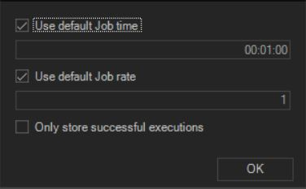
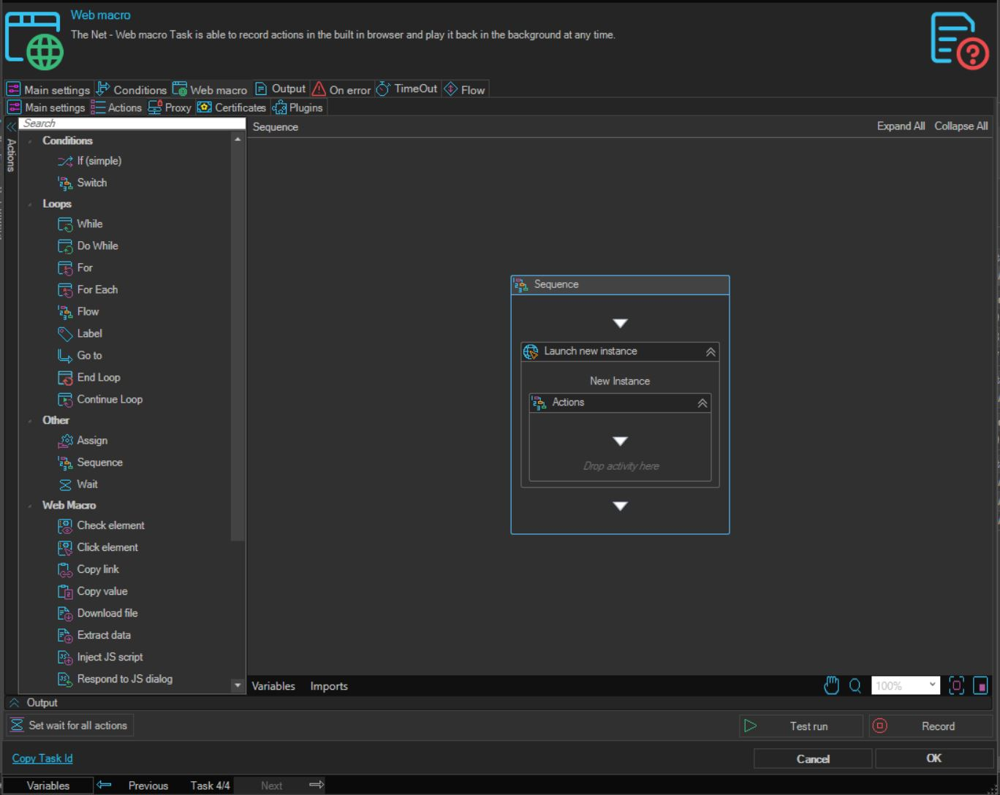

# RPA Job Configuration with VisualCron

## Step 1 - Set up Environment Credentials and Connections    
Create and manage system and user requirements for authentication between required services and the server environment. 

  

- From server settings menu, navigate and select the _**Credentials**_ view.  
 
  

- From server settings menu, navigate and select the _**Connections**_ view.  
- These can be reused as required when creating new jobs and tasks.

## Step 2 - Create a New Job

Create a new job for grouping one or more related RPA tasks for acheiving a desired workflow.

 - Right click on the Job Group View, navigate and select _**Add Job**_ from the menu. 

:::tip Confirm ROI Values when Creating a new Job

   

ROI value is captured at the job level.  Ensure your default ROI settings are updated and configured during job creation to start capturing history.  

The unit value is based on the currency configured in Server > ROI settings.  (**[Where to update default ROI values](#Measure-and-Track-ROI-for-RPA-Tasks)**)   
 - Job rate represents savings in *ex.USD* per hour for all tasks assigned to the job.
 - Job time represents saving in time *ex. minutes* for all tasks assigned to the job.
:::

### Create an RPA Task for a Web Based Process   

Add and record one or more web rpa tasks.  This task type should be used for recording manual tasks with a web browser and supports background replay of multiple tasks in paralell.

  

 - Right click on the RPA job, navigate and select _**Add Task > Net > Web Macro**_ 

### Create an RPA Task for Windows Desktop and Hybrid *(Web & Desktop)* Processes

Add and record one or more desktop or hybrid tasks.  This task type should only be used for recording simple desktop tasks and requires full control of the host system.

   

 - Right click on the RPA job, navigate and select _**Add Task > Interactivity > Robot**_  

:::caution

- The RPA desktop recorder will take full control of the host system in order to execute the workflow.
  - A dedicated machine is preferred for executing the playback of desktop rpa tasks in order to ensure sufficient resources are available and that the recording and playback of tasks do not interfere with the management of other critical operations. 

- RPA desktop tasks can only support recording workflow on the host system which VisualCron is installed.
  - The RPA desktop recorder does not currently support the ability to replay workflow recorded on a remote virtual machine.

:::

## Step 3 (Optional) - Use Conditions or Triggers for Jobs and Tasks 

### Configure a Job or Task Condition

  

 - Right click to edit an RPA **job or task**, navigate to the _**Condition Tab**_ to configure a conditional status requirement for starting the RPA **job or task**.

### Configure a Job Trigger

  
 
 - Select the Triggers tab from the **Edit Job* view to add a time or event trigger.
 - *Shortcut:* Right click on an RPA *job*, navigate to the _**Triggers**_ from the menu to configure a custom requirement for starting the RPA **job**.  

:::tip Ideas for getting started with with OpCon RPA 

**Ideas for RPA Job Execution**  
 - Start an rpa job on specific days of the week and/or time of the day.

 - Start an rpa job once a previous job condition or status has been fulfilled.

 - Start an rpa job by creating a self-service button for authorized users access on-demand.

 - Start an rpa job based on file activity with an MFT Server cloud trigger or a file arrival job dependency.  
  -- [Learn more about what is possible with OpCon MFT Server Triggers here.](https://help.smatechnologies.com/opcon/agents/opconmft/server-triggers)

 - Start an rpa job using an opcon event triggered by another process.  

 - Start an rpa job by updating a variable trigger in visualcron.  

---

**Ideas for Optimizing OpCon Schedules**    

 - Upload and download web based files or execute manual file movements.  

 - Copy, parse and store data from a file or web page into a variable.  

 - Copy, parse and store data from a file or a web page table into a file. *(ex. excel)*  

 - Perform a task for a windows based application.  

 - Perform Windows system or local server related tasks.  
  -- *ex. Perform core business windows client tasks.*  

 - Perform a task for a web browswer based application.  
  -- *ex. Update customer and employee information.*  

:::